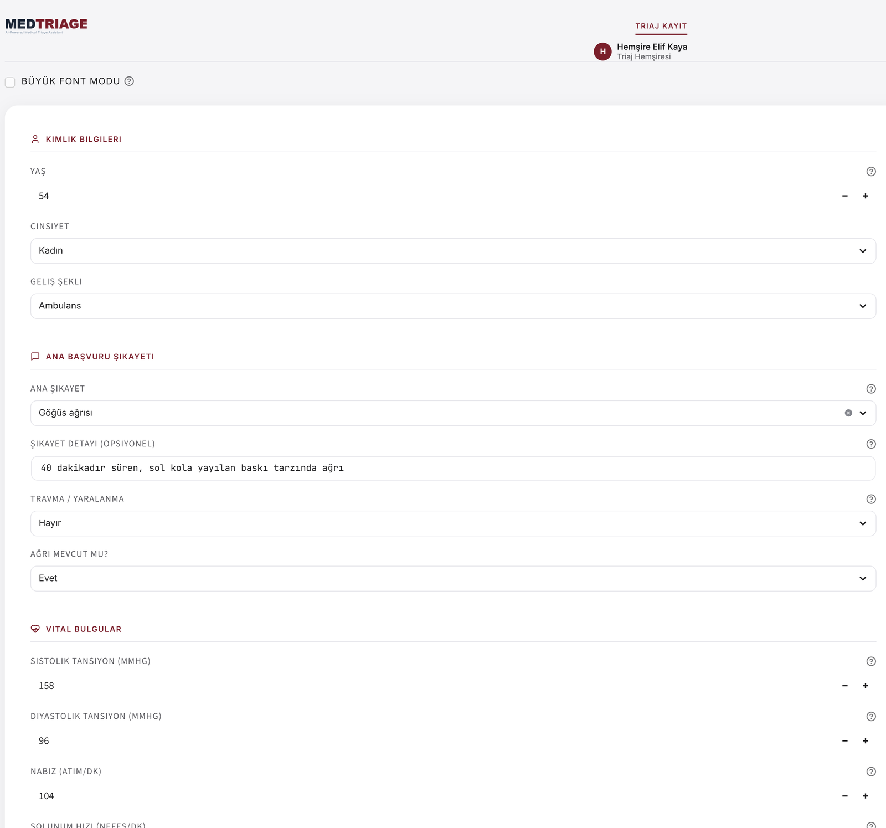
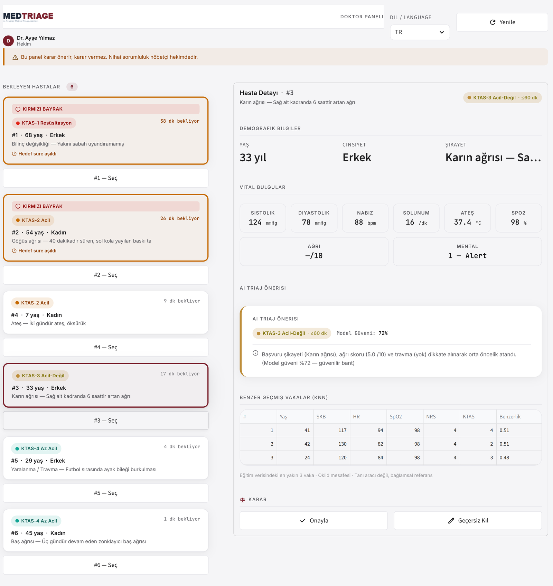

<div align="center">


**Acil serviste KTAS triaj seviyesi öneren, iki katmanlı klinik karar destek sistemi**

[**▶ Canlı Demo**](https://medtriageaiassistant.streamlit.app) &nbsp;·&nbsp;
[Model Kartı](model/model_card.md) &nbsp;·&nbsp;
[Kural Motoru](shared/rules.py)


</div>

> [!WARNING]
> **Bu proje bir portfolyo/eğitim demosudur; onaylı bir tıbbi cihaz değildir.**
> FDA/CE belgesi yoktur ve gerçek klinik ortamda tek başına kullanılamaz.
> Nihai triaj kararı her zaman yetkili sağlık personelinin sorumluluğundadır.

---

## Proje ne yapıyor?

Acil servise gelen bir hastanın **KTAS** (Korean Triage and Acuity Scale) aciliyet seviyesini —
1 (resüsitasyon) ile 5 (acil olmayan) arası — öneren bir karar destek sistemi.
İki kullanıcısı var: hastayı kayıt eden **triaj hemşiresi** ve kuyruğu yöneten **hekim**.

Sistem kendini hemşirenin yerine koymaz. Bu belgede ölçümleriyle gösterildiği gibi model,
insan triaj hemşiresinden geridedir ve bunu gizlemez. MedTriage bir **ikinci okuyucudur**:
gözden kaçabilecek hayati bulguları yakalar, bağlamsal bir öneri sunar ve
**ne zaman emin olmadığını söyler**.

Bu belge yalnızca "ne yapar"ı değil, **her performans sayısının hangi veri özelliğinden ve
hangi modelleme kararından kaynaklandığını** açıklar. Tüm sayılar `python model/evaluate.py`
ile üretilir ve [`model/model_card.md`](model/model_card.md) dosyasından alınır — hiçbiri
elle yazılmamıştır.

### İçindekiler

- [Mimari: neden iki katman](#mimari-neden-iki-katman)
- [Ekranlar](#ekranlar)
- [Teknoloji yığını](#teknoloji-yığını)
- [Veri seti](#veri-seti)
- [Sonuçlar](#sonuçlar)
- [Sonuçların arkasındaki kararlar](#sonuçların-arkasındaki-kararlar)
- [Kural motoru](#kural-motoru)
- [Kurulum ve çalıştırma](#kurulum-ve-çalıştırma)
- [Proje yapısı](#proje-yapısı)
- [Sınırlılıklar](#sınırlılıklar)

---

## Mimari: neden iki katman

Sistem **kritik işi modele bırakmaz**. İki bağımsız katman vardır ve sıraları önemlidir:

```
Hasta girişi
     │
     ├─► 1. KURAL MOTORU  (deterministik, yaşa göre eşikli)
     │      hayati bulgu var mı?
     │      ── EVET ──► model ATLANIR, hasta KTAS-1/2'ye alınır
     │
     └─► 2. ML MODELİ  (yalnızca kural tetiklenmediyse)
            KTAS önerisi + kalibre edilmiş güven skoru
                 │
                 └─► düşük güven ► "model kararsız" uyarısı
                          │
                          └─► 3. HEKİM  onaylar veya geçersiz kılar
                                 karar + gerekçe + isim → denetim izi
```

Gerekçe basit: modelin doğruluğu %68. Hayati bir bulgunun yakalanması %68'lik bir şeye
bırakılamaz. SpO2 %85, yanıtsız hasta veya solunum 4/dk gibi durumlar **kesin eşiklerle**
yakalanır; bunlar denetlenebilir, açıklanabilir ve test edilebilir. Model yalnızca bu ağın
altından geçen, klinik olarak belirsiz vakalarda devreye girer. Son söz her zaman hekimindir
ve verdiği karar `decision_log` tablosuna adıyla birlikte yazılır.

---

## Ekranlar

**Triaj kayıt formu** — hemşire hastayı yapılandırılmış alanlarla kaydeder. Ana şikayet
serbest metin değil, 26 kanonik semptom kodundan seçilir; aynı taksonomi modelin eğitiminde
de kullanıldığı için form ile eğitim verisi aynı dili konuşur.



**Hekim paneli** — kuyruk KTAS seviyesine göre sıralanır; kırmızı bayraklı ve hedef süresi
aşan hastalar işaretlenir. Sağ tarafta hastanın vitalleri, modelin önerisi ve **gerçek güven
skoru**, kararın gerekçesi ve eğitim verisindeki en benzer 3 vaka görünür. Hekim öneriyi
onaylar veya seviyeyi düzelterek geçersiz kılar.



---

## Teknoloji yığını

| Katman | Teknoloji | Neden bu seçildi |
|:--|:--|:--|
| Arayüz | **Streamlit 1.53** (çok sayfalı) | Python veri yığınının içinde kalıyor; model ile arayüz arasında ayrı bir API katmanı gerekmiyor. Görsel tasarım, elle yazılmış CSS tasarım token'larıyla (`shared/theme.py`) özelleştirildi. |
| Model | **XGBoost 3.2** | Küçük, tablo tipi ve dengesiz veride gradient boosting sınıfının en güçlüsü; karşılaştırma tablosu [aşağıda](#4-model-seçimi). |
| Dengeleme | **imbalanced-learn 0.14** (SMOTE) | KTAS-1 sınıfında yalnızca 26 örnek var. SMOTE, `imblearn.Pipeline` içinde ve **yalnızca eğitim katlamasında** çalışır. |
| Kalibrasyon | **scikit-learn 1.7** · `CalibratedClassifierCV` (isotonic) | "%72 eminim" ifadesinin gerçekten %72 anlamına gelmesi için. Arayüzdeki güven bandı bu kalibrasyona dayanır. |
| Ön işleme | scikit-learn `Pipeline` + `ColumnTransformer` | İmputasyon ve one-hot kodlama pipeline içinde; çapraz doğrulamada veri sızıntısı **yapısal olarak** imkânsız. |
| Açıklanabilirlik | **SHAP 0.51** (TreeExplainer) | Her öneri için hangi bulgunun ne kadar etkili olduğu. Ayrıca eğitim verisinden en yakın 3 komşu (Öklid mesafesi) bağlamsal referans olarak gösterilir. |
| Veri | pandas 2.3 · numpy 2.1 · openpyxl | Veri seti Excel formatında dağıtılıyor. |
| Kalıcılık | **SQLite** (WAL modu) | Hasta kuyruğu ve `decision_log` denetim izi. Kurulum gerektirmez, demo tek dosyada taşınır. |
| Test | **pytest 9.1** | Kural motoru için 59 regresyon testi. |

Sürümler `requirements.txt` içinde **pinlenmiştir** (`>=` değil `==`): bu proje sklearn ve
xgboost API'lerine doğrudan bağlıdır ve sessiz davranış değişiklikleri model çıktısını bozar.

---

## Veri seti

Kaynak: [KTAS Dataset](https://www.kaggle.com/datasets/llncss/ktas-dataset) — Kore acil servis
verisi, akademik yayınlı, anonimleştirilmiş.

| Özellik | Değer |
|:--|:--|
| Hasta sayısı | 1267 |
| Ham sütun | 24 |
| Hedef değişken | `KTAS_expert` (uzman triaj etiketi) |
| İkinci insan etiketi | `KTAS_RN` (triaj hemşiresi) — **baseline olarak kullanılır** |
| Serbest metin şikayet | 427 farklı ifade |

### Sınıf dağılımı — projenin en belirleyici kısıtı

| KTAS | Anlam | Hasta | Oran |
|:--|:--|:--|:--|
| 1 | Resüsitasyon | **26** | %2.1 |
| 2 | Acil | 220 | %17.4 |
| 3 | Acil değil | 487 | %38.4 |
| 4 | Az acil | 459 | %36.2 |
| 5 | Acil olmayan | 75 | %5.9 |

En kritik sınıfta **26 örnek** var. 5 katlamalı çapraz doğrulamada bu, katlama başına ~5 hasta
demek. Bu sayı, KTAS-1 ile ilgili her metriğin geniş bir belirsizlik payı taşıdığı anlamına
gelir ve aşağıdaki sonuçların çoğunu doğrudan açıklar.

### Eksik veri profili

| Sütun | Eksik | Oran |
|:--|:--|:--|
| `Saturation` (SpO2) | 697 | **%55.0** |
| `NRS_pain` (ağrı skoru) | 556 | **%43.9** |
| `DBP` | 29 | %2.3 |
| `SBP` | 25 | %2.0 |
| `RR` | 22 | %1.7 |
| `HR` | 20 | %1.6 |
| `BT` | 18 | %1.4 |

İki sütunun yarıya yakını boş. Bu bir veri kalitesi kusuru gibi görünür ama aslında **klinik
bir davranış izidir**: acil serviste SpO2 ve ağrı skoru, hastanın durumu gerektirdiğinde
ölçülür. Ölçülmemiş olması, hastanın stabil göründüğüne dair dolaylı bir bilgi taşır. Bu
gözlem modelleme kararlarımızdan birini doğrudan belirledi
(bkz. [Eksik veri bir sinyaldir](#3-eksik-veri-bir-sinyaldir)).

### İnsan baseline'ı: `KTAS_RN`

Veri setinde hemşirenin verdiği triaj seviyesi de var. Uzman etiketiyle uyumu **%85.3**.
`mistriage` sütunu bunu doğruluyor: 1267 vakanın 1081'inde hemşire doğru, 55'inde alt-triaj,
131'inde üst-triaj yapmış.

Bir triaj modelinin anlamlı tek referansı, yardım etmeye çalıştığı insandır. Bu yüzden
buradaki tüm sonuçlar hemşire baseline'ıyla **yan yana** raporlanır.

---

## Sonuçlar

5 katlamalı stratified çapraz doğrulama · 1267 hasta · 19 özellik

| | Doğruluk | ±1 seviye | KTAS-1 recall | KTAS-2 recall | Alt-triaj |
|:--|:--|:--|:--|:--|:--|
| **Model** (XGBoost + SMOTE + kalibrasyon) | **%67.9** | %94.6 | **0.615** | 0.486 | %16.4 |
| **Hemşire** (`KTAS_RN` — insan baseline) | **%85.3** | %98.5 | 0.577 | 0.832 | %10.3 |

Model genel doğrulukta hemşireden **17.4 puan geride**, ancak **en kritik sınıfta hemşireyi
geçiyor** (KTAS-1 recall 0.615 / 0.577). Aşağıdaki bölüm bu iki cümlenin de nedenini açıklıyor.

---

## Sonuçların arkasındaki kararlar

### 1. Neden hemşireyi geçemiyoruz

Bu bir mühendislik başarısızlığı değil, veri kısıtı. Üç sebep:

**(a) Model, hemşirenin gördüğünün küçük bir kısmını görüyor.** Elimizde 13 sayısal alan ve bir
şikayet kategorisi var. Hemşire ise hastanın rengini, terlemesini, konuşma biçimini,
yürüyüşünü, refakatçisinin anlattıklarını ve yılların örüntü bilgisini kullanıyor. Tabloya
sığmayan bu bilgi, aradaki 17 puanın büyük kısmıdır.

**(b) Hedef etiketin kendisi öznel.** `KTAS_expert` de bir insan yargısıdır, mutlak gerçek
değil. Uzman ile hemşire arasındaki %85 uyum, aslında **iki uzman insanın birbiriyle uyumunun
tavanını** gösteriyor. Model bu tavana değil, tek bir uzmanın kararına fit ediliyor.

**(c) Örneklem küçük.** 1267 satır, 5 sınıflı ve dengesiz bir problem için azdır. Özellikle
KTAS-1 (26 örnek) ve KTAS-5 (75 örnek) için model istikrarlı bir sınır öğrenemiyor.

**Bunun ürün karşılığı:** MedTriage hemşirenin yerine geçme iddiasını taşımaz,
**ikinci okuyucu** olarak konumlanır. Sayıyı süslemek yerine sistemin gerçekten yapabildiği
işi tanımlamak, hem klinik olarak doğru hem de mühendislik olarak dürüst bir duruştur.

---

### 2. Şikayet metni: tek en büyük kazanım

| Özellik seti | Doğruluk | ±1 seviye |
|:--|:--|:--|
| Yalnızca vitaller | %60.0 | %92.0 |
| Vitaller + kanonik semptom kodu | **%67.9** | **%94.6** |

Triajda hastanın *neden geldiği*, vitallerinden çoğu zaman daha belirleyicidir. Normal
vitallerle gelen bir göğüs ağrısı ile normal vitallerle gelen bir bilek burkulması aynı şey
değildir. `chief_complaint` sütununu modele bağlamak **+7.9 puan** doğruluk getiriyor —
projedeki tek en büyük kazanım.

**Neden doğrudan kullanılamıyor:** iki ayrı problem var.

1. **Metin kirli.** 1267 satırda 427 farklı ifade var ve aynı şey defalarca farklı yazılmış:
   `abd pain` · `abd. pain` · `abdomen pain` · `pain, abdominal` → hepsi karın ağrısı
   `ant. chest pain` · `left chest pain` · `pain, chest` · `discomfort, chest` → hepsi göğüs ağrısı
2. **Dil uyuşmazlığı.** Eğitim verisi İngilizce, uygulama formu Türkçe. Ham metin üzerine
   kurulan herhangi bir özellik, gerçek kullanımda hiçbir şeye eşleşmezdi.

**Çözüm — [`shared/symptoms.py`](shared/symptoms.py):** 26 kanonik semptom kodundan oluşan bir
taksonomi. Her kod bir regex kalıbı, bir Türkçe ve bir İngilizce etiket taşır. Bu tek modül üç
yeri birden besler:

- **Eğitim hattı**, veri setindeki İngilizce serbest metni koda indirger
- **Triaj formu**, açılır listesini aynı kodlardan üretir (yani kullanıcı zaten temiz veri girer)
- **Kural motoru**, kırmızı bayrak eşleşmesini bu kodlar üzerinden yapar

Taksonomi vakaların **%85.3'ünü** kapsıyor; kalanı `other` koduna düşüyor.

Bu tasarımın asıl değeri şudur: dil uyuşmazlığı bir çeviri katmanıyla *yamalanmadı*, ortak bir
kod uzayı tanımlanarak **ortadan kaldırıldı**.

---

### 3. Eksik veri bir sinyaldir

Verinin **%55'inde SpO2**, **%44'ünde ağrı skoru** eksik. Yaygın refleks bu boşlukları
doldurup geçmektir; burada tersi yapıldı.

Ölçümün yapılmamış olması rastgele değil: acil serviste SpO2 ve ağrı skoru, hastanın durumu
gerektirdiğinde ölçülür. Dolayısıyla "ölçülmemiş" bilgisinin kendisi, hastanın stabil
göründüğüne dair dolaylı bir sinyal taşır. Model bu sinyali `spo2_missing` ve `pain_missing`
bayraklarıyla görür ve bu bayraklar **imputasyondan önce** hesaplanır — sonra hesaplansaydı
hepsi sıfır olur, taşıdıkları bilgi tamamen kaybolurdu.

İmputasyonun kendisi de veri yükleme adımında değil, sklearn `Pipeline`'ının içindedir. Bunun
ayrı bir önemi var: medyan tüm veri üzerinde hesaplansaydı test katlamasının bilgisi eğitime
sızardı. Pipeline sayesinde **her katlama kendi medyanını hesaplıyor** ve sızıntı yapısal
olarak imkânsız hale geliyor.

---

### 4. Model seçimi

Beş yapılandırma aynı çapraz doğrulama bölmeleri üzerinde karşılaştırıldı:

| Model | Doğruluk | ±1 | KTAS-1 recall | Alt-triaj |
|:--|:--|:--|:--|:--|
| HistGradientBoosting | %65.7 | %93.2 | 0.500 | %17.2 |
| HistGradientBoosting (class_weight) | %65.4 | %93.4 | 0.577 | %17.5 |
| RandomForest (balanced) | %67.1 | %93.8 | 0.615 | %15.2 |
| HistGradientBoosting + SMOTE | %67.7 | %94.8 | 0.577 | %16.9 |
| **XGBoost + SMOTE** | **%69.4** | **%95.2** | **0.654** | **%15.8** |

XGBoost + SMOTE her metrikte önde olduğu için birincil model seçildi.

**Sınıf dengesizliğine neden SMOTE, neden `class_weight` değil?** İkisi de denendi (tablodaki
2. ve 4. satır): KTAS-1 recall'ı ikisinde de aynı (0.577), ancak SMOTE doğrulukta 2.3 puan öne
geçti. Yorum: 26 örneklik bir sınıfta ağırlıklandırma, modelin var olan az sayıda örneğe daha
sıkı uymasına yol açıyor; SMOTE ise özellik uzayında ara örnekler üreterek daha yumuşak bir
sınır öğretiyor ve bu, komşu sınıflara taşan hataları azaltıyor. Karşılaştırma
HistGradientBoosting üzerinde yapıldı; XGBoost'ta yalnızca kazanan yapılandırma (SMOTE) denendi.

**Kritik detay:** SMOTE `imblearn.Pipeline` içindedir, yani **yalnızca eğitim katlamasında**
uygulanır. Test katlamasına sentetik örnek sızmaz.

---

### 5. Kalibrasyon: bilinçli bir takas

Bir karar destek aracında "%73 eminim" ifadesinin bir karşılığı olmalıdır: model %73 dediği
vakaların gerçekten yaklaşık %73'ünde haklı çıkmalıdır. Ham gradient boosting çıktıları bu
anlamda güvenilmezdir — aşırı özgüvenlidir.

Isotonic regresyonla kalibrasyon uygulandı. Bedeli ve getirisi:

| | Doğruluk | Güven skoru anlamlı mı? |
|:--|:--|:--|
| XGBoost + SMOTE (kalibresiz) | %69.4 | Hayır — güven ≥ 0.70 bölgesinde doğruluk yalnızca %78 |
| **XGBoost + SMOTE + kalibre** | %67.9 | **Evet** |

**Kalibrasyon sonrası güven–doğruluk eğrisi:**

| Güven eşiği | Kapsam | O bölgede doğruluk | Hasta |
|:--|:--|:--|:--|
| ≥ 0.40 | %92.5 | %70.3 | 1172 |
| ≥ 0.50 | %71.0 | %77.4 | 899 |
| ≥ 0.60 | %50.9 | %83.6 | 645 |
| **≥ 0.70** | **%32.0** | **%89.4** | **406** |
| ≥ 0.80 | %12.4 | %91.1 | 157 |

Eğrinin monoton yükselmesi kalibrasyonun çalıştığının kanıtıdır. Pratik sonucu şudur:
**hastaların üçte birinde model %89.4 doğrulukla çalışıyor — hemşire seviyesinin (%85.3)
üzerinde.**

**Neden 1.5 puan doğruluktan vazgeçildi:** ne zaman güvenileceği bilinmeyen bir ikinci okuyucu
işe yaramaz. Hekim, %90 doğru olduğu bilinen bir öneri ile "model kararsız" etiketli bir
öneriyi farklı ağırlıklarla değerlendirebiliyorsa sistem değer üretir; sabit ve anlamsız bir
yüzde gösteriliyorsa üretmez.

Arayüz bu eğriden türetilen iki eşik kullanır: **≥ 0.60 "güvenilir bant"**,
**< 0.40 "model kararsız"** (vakaların %7.5'i).

---

### 6. TF-IDF neden reddedildi

Şikayet metnini kanonik koda indirgemek yerine ham TF-IDF (1-2 gram) olarak vermek de denendi:

| Yaklaşım | Tam isabet | ±1 seviye |
|:--|:--|:--|
| Kanonik semptom kodu | %63.4 | **%94.1** |
| Ham TF-IDF (1-2 gram) | **%64.6** | %91.7 |

> Bu iki değer, karar aşamasında kurulan bir prototip hattında (tek bölme,
> HistGradientBoosting) ölçülmüştür; yukarıdaki nihai model sayılarıyla doğrudan
> karşılaştırılmamalıdır. Anlamlı olan iki yaklaşım arasındaki **fark yönüdür**, mutlak
> değerler değil.

TF-IDF tam isabette 1.2 puan önde ama **±1 doğrulukta 2.4 puan geride**. Bu şu demektir: daha
sık tam isabet ediyor, ama şaştığında **daha büyük şaşıyor** — KTAS-2'lik bir hastaya KTAS-4
diyebiliyor.

Bir güvenlik ağında bu yanlış takastır. Triajda bir seviyelik sapma genelde tolere edilir; üç
seviyelik sapma hasta zararıdır. Ayrıca TF-IDF sözlüğü İngilizce veri setine kilitlidir ve
Türkçe formda hiçbir şeye eşleşmez.

Bu nedenle TF-IDF birincil modele alınmadı, ablasyon olarak model kartında raporlanıyor.

---

### 7. KTAS-5 neden çöküyor

Sınıf bazlı recall:

| KTAS | Hasta | Model | Hemşire |
|:--|:--|:--|:--|
| 1 | 26 | **0.615** | 0.577 |
| 2 | 220 | 0.486 | 0.832 |
| 3 | 487 | 0.758 | 0.821 |
| 4 | 459 | 0.786 | 0.915 |
| 5 | 75 | **0.093** | 0.840 |

Model KTAS-5'i neredeyse hiç öngörmüyor. Karışıklık matrisi nedeni açıkça gösteriyor:

| Gerçek \ Tahmin | KTAS-1 | KTAS-2 | KTAS-3 | KTAS-4 | KTAS-5 |
|:--|:--|:--|:--|:--|:--|
| **KTAS-1** | 16 | 6 | 4 | 0 | 0 |
| **KTAS-2** | 3 | 107 | 85 | 23 | 2 |
| **KTAS-3** | 0 | 35 | 369 | 81 | 2 |
| **KTAS-4** | 0 | 12 | 81 | 361 | 5 |
| **KTAS-5** | 0 | 1 | 24 | 43 | **7** |

75 KTAS-5 hastasının 43'ü KTAS-4, 24'ü KTAS-3 olarak sınıflanmış. Sadece 7'si doğru.

**Sebep iki katmanlı:**

1. **Dengesizlik.** KTAS-5 verinin %5.9'u. Model her zaman KTAS-4 diyerek bu sınıfta neredeyse
   hiç ceza almıyor.
2. **Sınıflar fizyolojik olarak ayrışmıyor.** KTAS-4 ile KTAS-5 arasındaki fark vital
   bulgularda değil, klinik yargıdadır — ikisinin de vitalleri normaldir. Model elindeki
   sayısal alanlarla ayıramayacağı bir sınırı ayırmaya çalışıyor.

Buna karşılık **KTAS-1'de model hemşireyi geçiyor (0.615 / 0.577)** ve karışıklık matrisi bunun
neden olduğunu gösteriyor: 26 KTAS-1 hastasının hiçbiri KTAS-4 veya 5'e düşmemiş. En kritik
hastalar en kötü ihtimalle KTAS-3'e iniyor. Bu, SMOTE'un ve kural motorunun birlikte
tasarlanmasının doğrudan sonucudur.

**Ürün kararı:** model kartı 0.30 altındaki her recall'ı otomatik "zayıf sınıf uyarısı" ile
işaretler. Bu bir raporlama süsü değil, kullanım sınırıdır.

---

### 8. Alt-triaj neden ayrı ölçülür

Standart doğruluk metriği, hata yönünü göz ardı eder. Triajda iki hata türü **asimetriktir**:

- **Üst-triaj** (hastayı olduğundan acil saymak): kaynak israfı, gereksiz yatak/personel kullanımı
- **Alt-triaj** (hastayı olduğundan az acil saymak): **hasta zararı** — kritik hasta bekleme
  salonunda kalır

Bu yüzden ikisi ayrı raporlanır:

| | Alt-triaj | Üst-triaj |
|:--|:--|:--|
| Model | %16.4 | %15.7 |
| Hemşire | %10.3 | — |

Model hemşireden 6 puan fazla alt-triaj yapıyor. Bu, modelin tek başına kullanılmaması
gerektiğinin en somut gerekçesidir ve kural motorunun neden modelin *önünde* çalıştığını
açıklar: alt-triajın en tehlikeli biçimi olan "kritik hastayı kaçırma" senaryosu, modele hiç
bırakılmaz.

---

## Kural motoru

[`shared/rules.py`](shared/rules.py) hayati bulguları deterministik eşiklerle yakalar ve
tetiklendiğinde model devre dışı kalır. Üç tasarım kararı taşır:

**Yaşa göre eşikler.** Erişkin eşikleri çocukta yanlıştır: 6 aylık bir bebekte nabız 150
normaldir, erişkinde ciddi taşikardidir. Dört yaş bandı tanımlıdır (`<1`, `1–5`, `6–12`, `13+`)
ve nabız, solunum, tansiyon, ateş eşikleri banda göre seçilir. Yaş bilinmiyorsa erişkin bandına
düşülür.

**Şiddet derecelendirmesi.** Her kırmızı bayrak aynı aciliyette değildir; apne KTAS-1,
hipertansif kriz KTAS-2 önerir. Her kural kendi seviyesini döndürür ve birden fazla kural
tetiklenirse en kritik olan kazanır.

**Regresyon testleri.** [`tests/test_rules.py`](tests/test_rules.py) — 59 test: AVPU
seviyeleri, solunum ve ateş sınırları, yaş bantları, sınır değerler (SpO2 = 90, RR = 8),
bozuk/eksik girdi dayanıklılığı ve geriye uyumluluk. Bir güvenlik ağının sessizce bozulmaması
için test edilmesi şarttır.

```bash
pytest tests/ -v
```

---

## Kurulum ve çalıştırma

Kurmadan denemek için: **[medtriageaiassistant.streamlit.app](https://medtriageaiassistant.streamlit.app)**

```bash
pip install -r requirements.txt
```

Veri setini `data/ktas_raw.xlsx` olarak yerleştirin, ardından modeli eğitin:

```bash
python model/train_model.py
```

```bash
streamlit run app.py
```

Akış: KVKK onayı → rol seçimi (Hemşire / Hekim) → ilgili panel.
Uygulama `http://localhost:8501` adresinde açılır.

**Testler ve değerlendirme:**

```bash
pytest tests/ -v
```

```bash
python model/evaluate.py
```

`evaluate.py`, `model/model_card.md` dosyasını yeniden üretir. Bu README'deki tüm sayılar
oradan gelir.

> **Sürüm notu:** Kalibrasyon kendi içinde çapraz doğrulama kullandığından, farklı
> çalıştırmalarda doğruluk ±0.5 puan oynayabilir. Raporlanan değerler tek bir `evaluate.py`
> çalıştırmasına aittir.

---

## Proje yapısı

```
medtriage/
├── app.py                    # Giriş: KVKK onayı + rol seçimi
├── data/
│   ├── ktas_raw.xlsx         # KTAS veri seti (kullanıcı sağlar)
│   └── load_ktas.py          # Yükleme + temizleme (imputasyon YAPMAZ)
├── model/
│   ├── train_model.py        # Eğitim hattı — tek Pipeline
│   ├── estimators.py         # KTAS etiket adaptörü (pickle kararlılığı için ayrı)
│   ├── evaluate.py           # Dürüst değerlendirme → model_card.md
│   └── model_card.md         # ÜRETİLEN dosya — elle düzenlemeyin
├── shared/
│   ├── symptoms.py           # Kanonik semptom taksonomisi (tek doğruluk kaynağı)
│   ├── rules.py              # Kırmızı bayrak kural motoru
│   ├── auth.py               # Rol tabanlı erişim + denetim izi kimliği
│   ├── queue_store.py        # SQLite kuyruk + karar günlüğü
│   ├── icons.py              # Inline SVG ikon seti
│   └── theme.py              # Tasarım sistemi (renk/tipografi token'ları)
├── pages/
│   ├── 1_Triaj_Kayit.py      # Hemşire triaj formu
│   └── 2_Doktor_Paneli.py    # Hekim değerlendirme paneli
└── tests/
    └── test_rules.py         # Kural motoru regresyon testleri
```

---

## Sınırlılıklar

- **Model hemşireden 17 puan geridedir.** Tek başına triaj kararı için kullanılamaz.
- **KTAS-5'te recall 0.09.** Bu seviyede model önerisi bilgi taşımaz.
- **Alt-triaj oranı hemşireden 6 puan yüksek** (%16.4 / %10.3).
- **KTAS-1 metrikleri 26 örneğe dayanır.** Tek bir hastanın yer değiştirmesi bu metrikleri
  belirgin biçimde oynatır.
- **Tek merkez, tek ülke.** Veri Kore acil servisindendir; Türkiye'deki hasta profili, geliş
  şekli dağılımı ve triaj pratiği farklıdır. Performansın taşınacağı garanti değildir.
- **Semptom taksonomisi kapsamı %85.3.** Kalan vakalar `other` koduna düşer ve modele bu
  konuda bilgi gitmez.
- **Hedef etiket öznel.** `KTAS_expert` de bir insan yargısıdır.
- **Rol seçimi kimlik doğrulama değildir.** Parola yoktur; gerçek kurulumda yerini kurumsal
  SSO almalıdır.
- **Demo verisi her açılışta sıfırlanır.** Canlı demoda gördüğünüz kuyruk kalıcı değildir.

Ayrıntılı metrikler ve karışıklık matrisi için → [`model/model_card.md`](model/model_card.md)

---

<div align="center">

**Geliştirici:** Musa Barutcu &nbsp;·&nbsp;
**Lisans:** MIT &nbsp;·&nbsp;
[Canlı Demo](https://medtriageaiassistant.streamlit.app) &nbsp;·&nbsp;
[Model Kartı](model/model_card.md)

</div>
